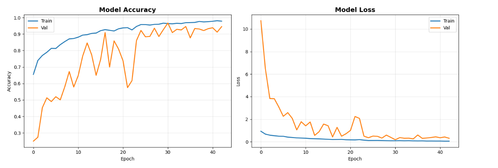
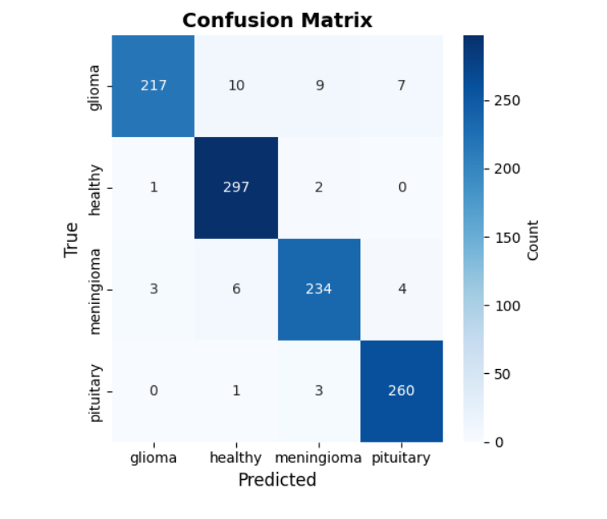

# Brain-Tumor-MRI-Classification-using-CNN
## Project Overview

This project implements a Convolutional Neural Network (CNN) using TensorFlow and Keras to classify brain MRI scans into tumor categories.

The model is trained on MRI images resized to 128x128 and normalized to improve convergence.

---

## Dataset

- Dataset: /kaggle/input/brain-tumor-mri-scans
- Structure: Each class stored in a separate folder
- Input size: 128x128 RGB images
- Preprocessing:
  - Image resizing
  - Normalization (pixel values scaled to [0,1])

## 📊 Model Performance

### Training & Validation Curves
results/confusion_matrix.png

The model was trained for **~50 epochs**. Here's what the curves tell us:

- **Train Accuracy** climbed steadily and reached ~**98%**
- **Validation Accuracy** was noisy early on (due to the small validation set), but stabilized around **92–95%** by the end
- **Train Loss** dropped smoothly close to **0**
- **Validation Loss** started very high (~11) but came down and stabilized around **0.2–0.4**

> The gap between train and validation is expected — the model generalizes well despite some noise in early epochs.

### Confusion Matrix

Results on the **test set**:

| Class | Correct | Wrong |
|------------|---------|-------|
| Glioma | 217 | 26 |
| Healthy | 297 | 3 |
| Meningioma | 234 | 13 |
| Pituitary | 260 | 4 |

- **Healthy** and **Pituitary** tumors were classified almost perfectly
- **Glioma** had the most misclassifications (often confused with Meningioma)
- Overall accuracy: **~95%**
